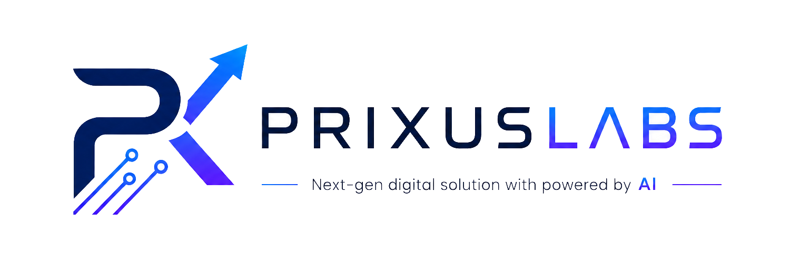

<div align="center">
  
  
  # Prixus Labs & Autonomous AI SEO Agent 🚀

  **A next-generation agency platform featuring a fully autonomous AI-driven SEO Growth Agent that researches, writes, and publishes high-converting technical content on autopilot.**

  [](https://reactjs.org/)
  [](https://vitejs.dev/)
  [](https://tailwindcss.com/)
  [](https://ai.google.dev/)
  [](https://github.com/features/actions)

</div>

---

## 🌟 The Innovation: Autonomous SEO Growth Agent

While most websites are static brochures, the Prixus Labs platform is a living, breathing growth engine. 

We have integrated a custom **Autonomous SEO Growth Agent** directly into the core architecture of the site. Powered by Google's cutting-edge Gemini LLMs and orchestrated via GitHub Actions, this agent works 24/7 to scale content marketing with zero human intervention.

### How the AI Agent Works
1. **Trend Discovery:** The agent autonomously discovers highly trending, high-value B2B tech topics (e.g., AI Integration, Enterprise Next.js).
2. **Keyword Optimization:** It researches search demand and targets primary, secondary, and LSI keywords seamlessly.
3. **Content Generation:** It drafts deeply technical, 100% original, contrarian articles tailored to CTOs and Founders.
4. **Automated Publishing:** Using GitHub Actions cron jobs, the agent automatically commits the new markdown blog to the repository.
5. **Vercel Edge Deployment:** Vercel detects the commit and instantly deploys the new SEO-optimized page to the edge network globally.
6. **Real-time Notifications:** The system dispatches an HTML email notification containing the SEO score, reading time, and direct links to the live post.

---

## 💻 Tech Stack & Architecture

- **Frontend Framework:** React 18 + Vite (Blazing fast HMR and optimized production builds)
- **Styling:** Tailwind CSS (Utility-first CSS for rapid, responsive UI development)
- **Animations:** Framer Motion (Smooth, physics-based micro-interactions and scroll reveals)
- **Icons:** Lucide React
- **AI Brain:** Google Generative AI (`gemini-3.1-flash-lite`, `gemini-3.5-flash`)
- **CI/CD:** GitHub Actions + Vercel
- **Email Service:** Nodemailer

---

## ✨ Key Features

- **Dynamic Booking Widget:** A seamless, integrated calendar and time-slot booking system.
- **Interactive AI Chatbot (Prix):** A floating AI assistant that qualifies leads and answers visitor questions.
- **Glassmorphism UI:** Stunning, modern visual aesthetics featuring blur effects, gradients, and deep dark modes.
- **Zero-Config SEO Pipeline:** The AI automatically generates all required metadata (SEO titles, meta descriptions, slugs).

---

## 🚀 Getting Started

To run the platform locally:

1. **Clone the repository**
   ```bash
   git clone https://github.com/sagar1252/prixuslabs-website.git
   cd prixuslabs-website
   ```

2. **Install Dependencies**
   ```bash
   npm install
   ```

3. **Set up Environment Variables**
   Create a `.env` file in the root directory and add:
   ```env
   VITE_GEMINI_API_KEY=your_gemini_api_key_here
   EMAIL_USER=your_email@gmail.com
   EMAIL_PASS=your_app_password
   ```

4. **Start the Development Server**
   ```bash
   npm run dev
   ```

5. **Trigger the AI SEO Agent Manually (Optional)**
   ```bash
   node scripts/generate-blog.js
   ```

---

<div align="center">
  <b>Built with ❤️ by Prixus Labs</b>
</div>
